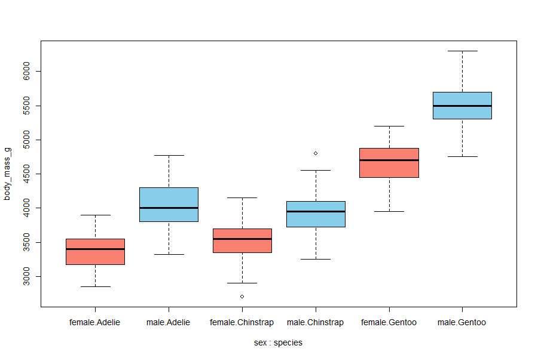

```{r setup, include=FALSE}
knitr::opts_chunk$set(echo = TRUE)
```

## R Markdown

This is an R Markdown document. Markdown is a simple formatting syntax for authoring HTML, PDF, and MS Word documents. For more details on using R Markdown see <http://rmarkdown.rstudio.com>.

When you click the **Knit** button a document will be generated that includes both content as well as the output of any embedded R code chunks within the document. You can embed an R code chunk like this:

```{r eval=TRUE}
x=1
```
Example for an equation: \\(E = mc^2\\)

```{r eval=TRUE}
library(palmerpenguins)
data("penguins")
head(penguins)
```
##summarize the species
```{r eval=TRUE,results='asis'}
pantcl4r::df2md(with(penguins,table(sex,species)))
```
##boxplot
```{r eval=TRUE}
png("penguins.png", width = 900, height = 600, pointsize = 14)
boxplot(body_mass_g ~ sex:species, data = penguins, col = c("salmon","skyblue"))
dev.off()
```

#cut some penguins
```{r eval=TRUE}
adelie <- subset(penguins, species == "Adelie")
cWeight <- cut(adelie$body_mass_g, 
               breaks = quantile(adelie$body_mass_g, c(0, 1/3, 2/3, 1), na.rm = TRUE), 
               include.lowest = TRUE, 
               labels = c("light", "medium", "heavy"))
table(cWeight)
table(cWeight, adelie$sex)
```
#Plot


